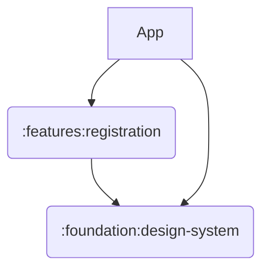

Budget tracker
==================

Simple expense tracker

* Fully functional
* Built entirely with Kotlin and Jetpack Compose
* Standalone, no internet connection 
* Dynamic & Dark Themes

## Features

| Registration                                                                                                    | Login |
|-----------------------------------------------------------------------------------------------------------------|-------|
|  |       |

## Tech stack
* [Jetpack Compose](https://developer.android.com/jetpack/compose) Android’s modern toolkit for building native UI
* [Hilt](https://developer.android.com/training/dependency-injection/hilt-android) Dependency injection library
* [Sqldelight](https://cashapp.github.io/sqldelight/) For generating typesafe Kotlin APIs from SQL statements

# Architecture
MVVM (TBA)

# Modularization
