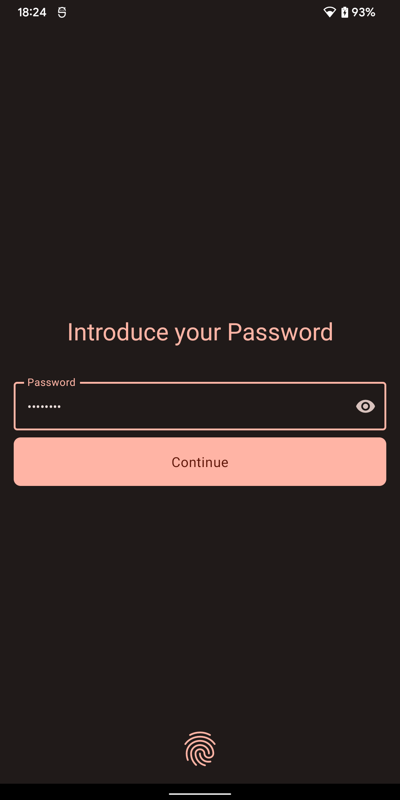
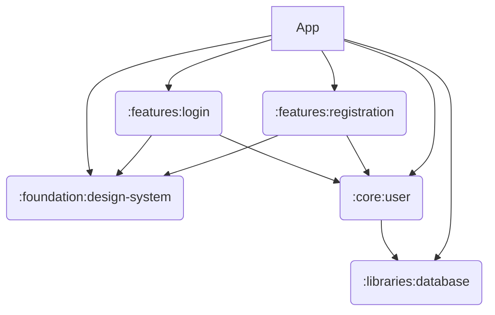

Budget tracker
==================

Simple expense tracker

* Fully functional
* Built entirely with Kotlin and Jetpack Compose
* Standalone, no internet connection 
* Dynamic & Dark Themes
* Encrypted

## Features

| Registration                                                                                                    | Login                                                                                      |
|-----------------------------------------------------------------------------------------------------------------|--------------------------------------------------------------------------------------------|
|  |  |

## Tech stack
* [Jetpack Compose](https://developer.android.com/jetpack/compose) Android’s modern toolkit for building native UI
* [Hilt](https://developer.android.com/training/dependency-injection/hilt-android) Dependency injection library
* [Sqldelight](https://cashapp.github.io/sqldelight/) For generating typesafe Kotlin APIs from SQL statements
* [DataStore](https://developer.android.com/topic/libraries/architecture/datastore) Data storage solution that allows you to store key-value pairs or typed objects
* [Kotlin Serialization](https://kotlinlang.org/docs/serialization.html) Provides sets of libraries for various platforms and serialization formats
* [Android Security Crypto](https://developer.android.com/jetpack/androidx/releases/security) Safely manage keys and encrypt files
* [Android Biometric](https://developer.android.com/jetpack/androidx/releases/biometric) Authenticate with biometrics or device credentials

# Architecture
MVVM (TBA)

# Modularization
